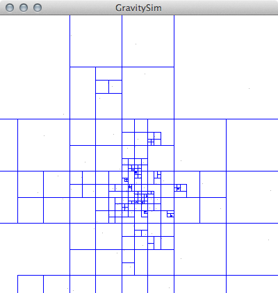
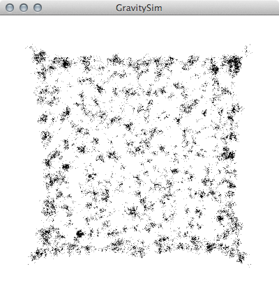
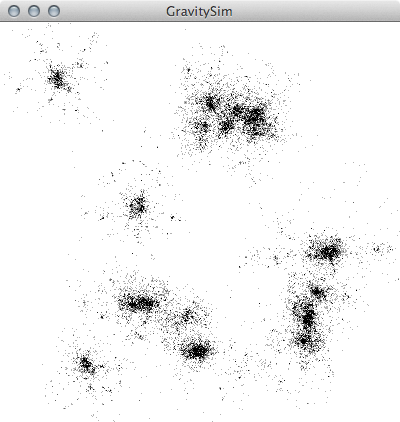

## About
We used CUDA with C to implement a parallel version of the the [Barnes-Hut](http://en.wikipedia.org/wiki/Barnes%E2%80%93Hut_simulation)  algorithm for the N-body galaxy simulator. We evaluated the program performance on the NVIDIA GPUs on the GHC machines, and our implementation achieves a 18.13x speedup with 32,000 particles in the galaxy.


We adopted a [sequential version](https://github.com/kgabis/gravitysim) of the simulator that uses the Barnes-Hut algorithm as starter code and then implemented a parallel version on top on it. 

The only dependency for the sequential version is the [GLFW3 library] and we have tried to run it locally. However since we didn't install GLFW3 on the GHC machines, visualization is turned off for the final parallel version. 

##### Installing GLFW3 on OSX
```
brew install --build-bottle --static glfw3
```

## Usage
Compile with ```make ``` and run it using ```./gravitysim```.  
The program takes in three arguments:
```
./gravitysim number_of_galaxies objects_per_galaxy galaxy_size
```  
For instance:  
```./gravitysim 20 1000 100``` runs a simulation of 20 galaxies with 1000 objects per galaxy and 100-pixel galaxy size.

The default with no argument is set to run ```./gravitysim 4 1000 100```

In the parallel version, the program will display the average simulation iteration runtime for both the sequential and the CUDA version. 

## Screenshots (for the sequential version)
  
  
  

## License
[The MIT License (MIT)](http://opensource.org/licenses/mit-license.php)
